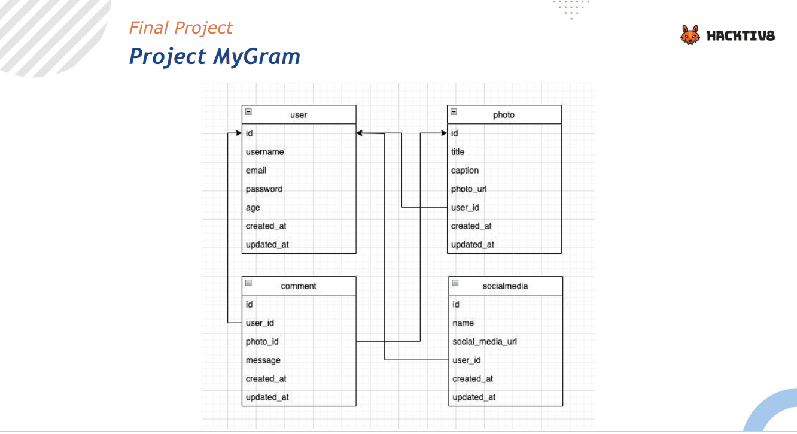

# MyGram

MyGram is a final project from DTS Kominfo FGA, to build instagram clone API that allows users to store and comment on photos of other users. It is built using the Gin Gonic framework and Gorm ORM in Go.

## Table of Contents

- [Requirements](#requirements)
- [Instalation](#instalation)
- [API Documentation](#api-documentation)
  - [Postman Documentation](#postman-documentation)
  - [Swagger Documentation](#swagger-documentation)
- [ERD (Entity Relationship Diagram)](#erd-entity-relationship-diagram)
- [Endpoints](#endpoints)
  - [User](#user)
  - [Social Media](#social-media)
  - [Photo](#photo)
  - [Comment](#comment)

## Requirements

- Go version 1.15 or higher
- PostgreSQL (13 or higher)


## Installation

1. Clone the repository:

   ```bash
   git clone https://github.com/salmaqnsGH/my-gram.git
   ```

2. Change to the project directory:
    ```bash
    cd my-gram
    ```
3. Open the `.env` file and update the necessary environment variables.
    * PORT example: `PORT=3000` means the application will listen on port 3000 for incoming requests.

    * DB_HOST example: `DB_HOST=localhost` or `DB_HOST=127.0.0.1` for a local database server.

    * DB_USER example: `DB_USER=mygram_user` for the database user.

    * DB_PASSWORD example: `DB_PASSWORD=myp@ssword` for the database password.

    * DB_PORT example: `DB_PORT=5432` for the default PostgreSQL port.

    * DB_NAME example: `DB_NAME=mygram_db` for the database name.

    * DEBUG_MODE example: `DEBUG_MODE=false` to disable debug mode or `DEBUG_MODE=true` to enable debug mode.

4. Install the dependencies:
    ```bash
    go get
    ```

5. Run the application:
    ```bash
    go run main.go
    ```
## API Documentation
### Postman Documentation

The Postman documentation for MyGram can be found here https://documenter.getpostman.com/view/14858801/2s93Xx1Q6f
 It provides detailed information on how to interact with the API endpoints using Postman.

### Swagger Documentation
MyGram also includes Swagger documentation that provides a graphical interface to explore and interact with
1. Make sure that you have already installed and running the MyGram application

2. Open a web browser and go to the Swagger URL for MyGram, at http://localhost:3000/swagger/index.html if you are running the application locally on your machine.

## ERD (Entity Relationship Diagram)



## Endpoints

### User

- **Register [POST]**

  Register a new user.

- **Login [POST]**

  Login with a registered user.

### Social Media

- **GetAll [GET]**

  Get all social media posts.

- **GetOne [GET]**

  Get a specific social media post.

- **CreateSocialMedia [POST]**

  Create a new social media post.

- **UpdateSocialMedia [PUT]**

  Update an existing social media post.

- **DeleteSocialMedia [DELETE]**

  Delete a social media post.

### Photo

- **GetAll [GET]**

  Get all photos.

- **GetOne [GET]**

  Get a specific photo.

- **CreatePhoto [POST]**

  Upload a new photo.

- **UpdatePhoto [PUT]**

  Update an existing photo.

- **DeletePhoto [DELETE]**

  Delete a photo.

### Comment

- **GetAll [GET]**

  Get all comments.

- **GetOne [GET]**

  Get a specific comment.

- **CreateComment [POST]**

  Create a new comment.

- **UpdateComment [PUT]**

  Update an existing comment.

- **DeleteComment [DELETE]**

  Delete a comment.


## Acknowledgements
This project uses the following third-party libraries:

* Gin Gonic framework (github.com/gin-gonic/gin)
* Gorm ORM (github.com/go-gorm/gorm)
* jwt-go (github.com/dgrijalva/jwt-go)
* crypto (golang.org/x/crypto)

